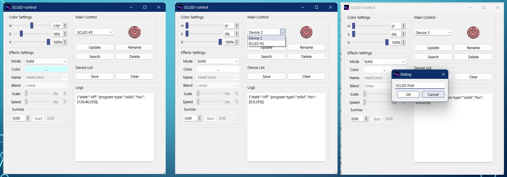
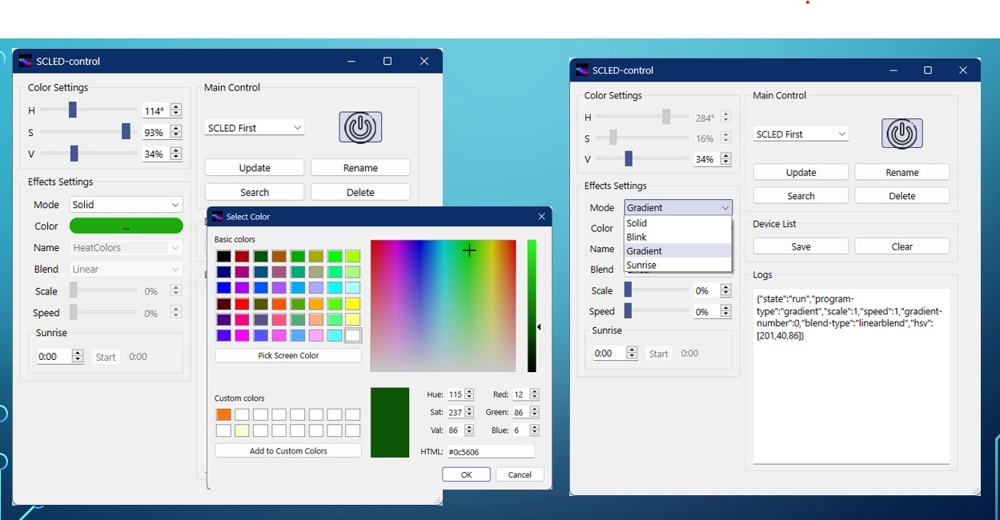
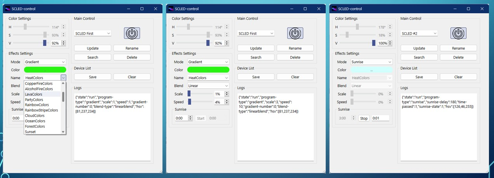

# SCLED Control
Приложение для управления устройствами SCLED для windows.  
> ⚠️ **Важно:** Для корректной работы с несколькими устройствами убедитесь, что ваш роутер **не блокирует** связь между устройствами в локальной сети.
**Особенности:**
- Поддержка до 240 устройств в подсети 
- Автопоиск и подключение устройств
- Не требуется соединение с интернетом и серверами
- Минималистичный удобный интерфейс
 





## API Reference

#### Состояние устройсва

```http
  GET http://192.168.0.168/
```
| Параметр             | Значение                          | Описание                                                                 |
|----------------------|-----------------------------------|--------------------------------------------------------------------------|
| state                | off                               | Отключено                                                              |
|                      | run                               | Работает                                                               |
|                      | pause                             | Пауза анимаций                                                         |
|                      | low_battery                       | Низкий уровень заряда                                                  |

#### Управление системой

```http
  POST http://SCLED+ChipId/api?key=value&key=...
```

| Параметр             | Значение                          | Описание                                                                 |
|----------------------|--------------------------|--------------------------------------------------------------------------|
| gradient-number      | 0 - 43                            | Номер градиента в палитре(индекс)                                               |
| blend-type           | noblend                           | Без смешивания                                                         |
|                      | linearblend                       | Линейное смешивание                                                    |
|                      | linearblend-nowarp                | Линейное смешивание без искажения интерполяцией                                    |
| speed                | 0 – 255                           | Скорость анимации или изменения эффекта                               |
| scale                | 0 – 255                           | Масштабирование эффекта                                                 |
| program-type         | solid                             | Заливка одним цветом                                                           |
|                      | blink                             | Мигание                                                                |
|                      | gradient                          | Градиент                                                               |
|                      | sunrise                           | Эффект будильника рассвет                                                  |
| sunrise-delay        | 0 - 2^16 in minutes               | Таймер до включения эффета рассвет  (в минутах)              |
| sunrise-state        | 0 - 1                             | Состояние эффекта рассвет: 0 — выкл, 1 — вкл                         |
| time-passed          | 0 - 2^16 in minutes               | Прошедшее время с начала рассвета (в минутах)                          |
| hsv                  | ffffff color format (hue, saturation, brightness) (255,255,255) | Формат цвета HSV: оттенок, насыщенность, яркость. Значение по умолчанию — белый цвет |